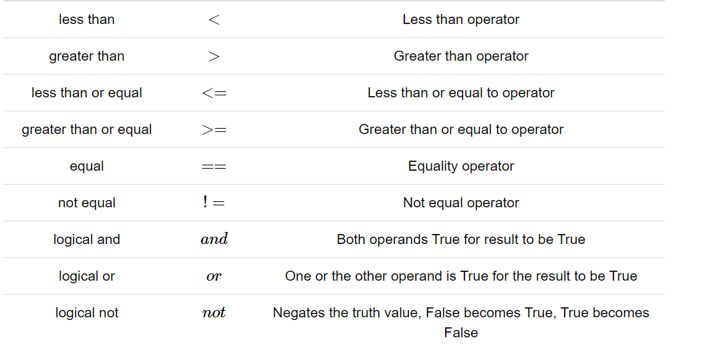
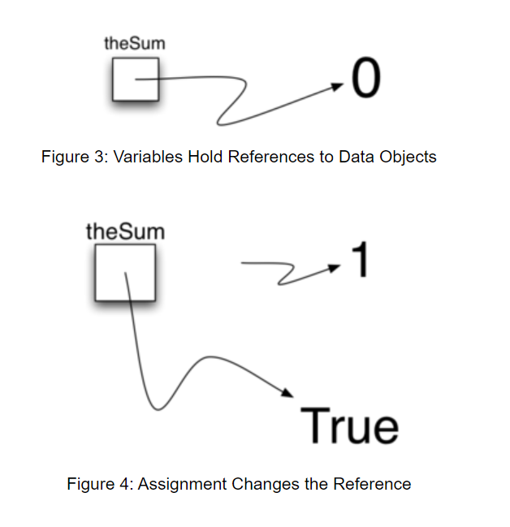
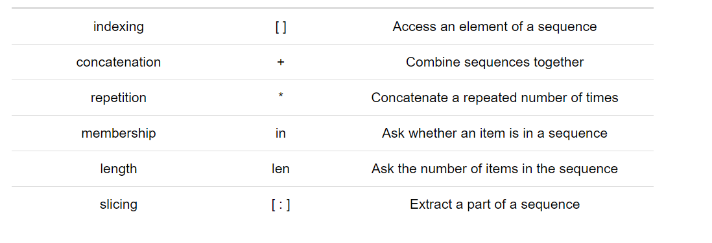
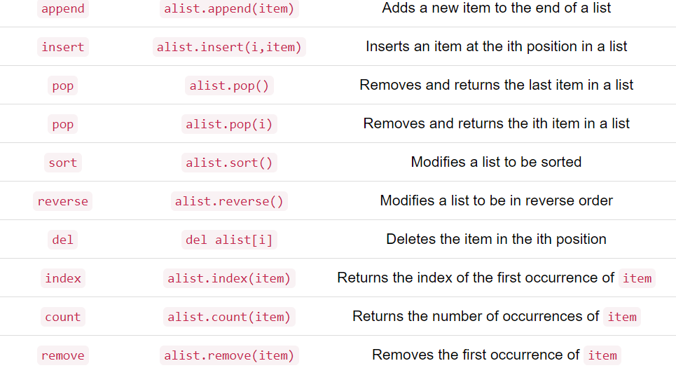
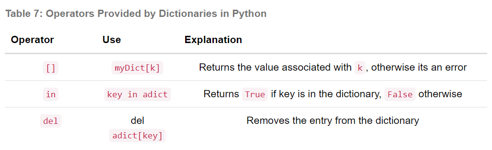

## Lists are mutable; strings are immutable.

## tuple is immutable, like a string.

# List is mutable

mylist = [1,3,5,24]
mylist[0] = 111
mylist =[111,3,5,24]
Name = "David"
myName[0] ="x" # show error

## A set is an unordered collection of zero or more immutable Python data objects.
## dictionary key: value
